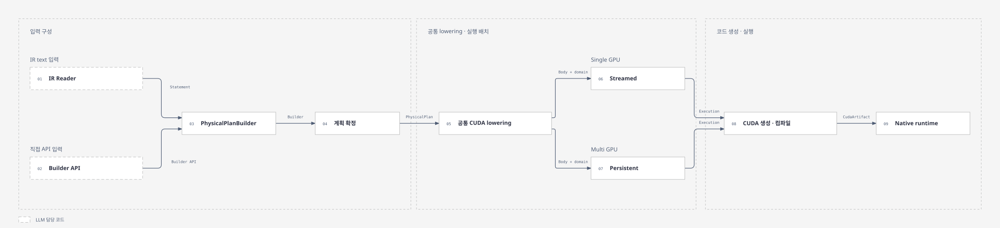

# Trinity Lowering Architecture

Trinity Lowering Repository는 선택된 연산 구현 및 실행 순서를 이용해 CUDA source와 컴파일 아티팩트를 생성합니다. 이 문서는 공개 인터페이스와 세 단계의 책임 경계를 안내합니다.

아래 공개 인터페이스는 Native CUDA 경로입니다. 공통 PhysicalPlan을 소비하는
Triton source/launch 경로와 제한된 Triton/Quack 후보 비교 경로도 별도로 존재합니다.
통합된 compile·benchmark·선택 경로가 모두 완성된 것은 아닙니다.
현재 작업 트리의 공통 계약은 [Planning](planning.md), provider별 진입점과 지원 차이는
[Triton provider](triton-provider.md#selection-boundary-and-current-limits)를 따릅니다.



## 인터페이스

```rust
// text IR 기반 PhysicalPlan 구성
pub fn lower_ir(
    text: &str,
    config: &IrConfig,
) -> Result<Vec<PhysicalPlan>, IrError>;

// PhysicalPlan 수동 구성 Builder API
pub struct PhysicalPlanBuilder { /* ... */ }

// CUDA 소스 생성
pub fn emit(plan: &PhysicalPlan) -> Result<CudaSource, EmitError>;

// 생성된 소스 컴파일
pub fn compile(source: CudaSource) -> Result<CudaArtifact, CompileError>;
pub fn compile_with_config(
    source: CudaSource,
    config: &CompileConfig,
) -> Result<CudaArtifact, CompileError>;
```

## 구성

### Planning

[Planning](planning.md)

Text IR 또는 `PhysicalPlanBuilder` 입력을 받아, Tensor Binding, 연산, Loop와 실행 순서를 `PhysicalPlan`으로 구성합니다.

### Emission

[Emission](emission.md)

`PhysicalPlan`을 참조해 지원 가능 커널 구현을 선택하고, 구체적 실행 배치를 담은 `CudaSource`를 생성합니다.

### Compile

[Compile 소스](../../src/compile/mod.rs)

`CudaSource`를 공유 라이브러리와 메타데이터를 포함한 `CudaArtifact`로 변환해, 실제 실행 가능한 형태로 변환합니다.

## 소스 디렉토리

현재 구현 파일을 책임별로 배치한 구조다. 향후 후보 선택기나 backend를 위한 빈 모듈은 만들지 않았다.

```text
src/
├── analysis/
│   ├── ir/              # 공통 syntax, ScheduledIr 수집/표현, PhysicalPlan projection
│   ├── facts/           # 접근·scope/dependency·flow·shape·logical dtype 사실
│   ├── storage/         # backing storage, local read/초기화/publication
│   ├── regions.rs       # 원본 region·전체 관측 입출력·공통 def-use
│   ├── views.rs         # 공통 tensor shape/stride/offset 해석
│   └── plan/            # PhysicalPlan 타입·builder·reader·binding·normalize
├── emit/
│   ├── candidate.rs     # operation 후보 열거
│   ├── region.rs        # 전체 region 후보·reference·선택 프로그램 연결
│   ├── request.rs       # 독립 kernel 요청
│   ├── prepare.rs       # 공통 후보 입력 준비
│   ├── execution.rs     # 요청 실행 모델
│   ├── provider/
│   │   ├── cute/        # CuTe operator 명세와 CUDA template
│   │   ├── triton/      # provider 진입점·plan·lowering·codegen
│   │   └── quack/       # recognition(연산 인식)·pattern(API 지원)·호출 wrapper
│   ├── native/          # Native 계약·collect·combine·cuda 실행 배치/render
│   ├── wrapper/         # Python 실행 프로그램·reference·후보 비교
│   ├── implementation/  # 기존 구현 열거 API (provider registry와 별도)
│   └── fusion/          # 기존 fusion API; 실행 연결은 여전히 미구현
├── compile/             # artifact compile/link
├── native/              # C++ ABI·runtime (emit/native와 구분)
├── platform/            # target capability
├── config.rs
├── dtype.rs
├── python.rs            # 기존 Python binding
├── tests.rs
└── lib.rs               # 공개 API re-export
```

`analysis::analyze_text`, `analysis::ProgramFacts`, `analysis::dtype`와 루트의
`PhysicalPlanBuilder`, `lower_ir`, `triton::*`, implementation/fusion 공개 API 경로는 유지한다.
디렉토리 이동이 IR 의미, dtype 정책, 후보 지원 조건 또는 생성 코드를 바꾸지는 않는다.
`PythonProgram`/`emit_python`의 이름도 유지하며 구현 파일만 `emit/wrapper/`에 모았다.

영역 단위 Quack 연결은 [Quack provider](quack-provider.md)를 따른다. 기존 독립 operation 후보와
Native 경로를 유지하면서, 별도 `region_candidates` 계약으로 scheduled region 비교를 연결한다.

## 탐색

| 확인할 내용                 | 시작 파일                                                                                                                                            |
| --------------------------- | ---------------------------------------------------------------------------------------------------------------------------------------------------- |
| 공개 API                    | [src/lib.rs](../../src/lib.rs)                                                                                                                       |
| Plan 구성·확정              | [analysis/plan/builder.rs](../../src/analysis/plan/builder.rs)                                                                                                         |
| 공통 emit·검증 진입점       | [emit/mod.rs](../../src/emit/mod.rs)                                                                                                                 |
| 공통 후보 입력 준비 | [emit/prepare.rs](../../src/emit/prepare.rs)                                                                                                         |
| Quack 연산 패턴 분류 | [quack/recognition.rs](../../src/emit/provider/quack/recognition.rs) |
| 공통 region·view 사실 | [regions.rs](../../src/analysis/regions.rs), [views.rs](../../src/analysis/views.rs) |
| 분류와 독립적인 region/facts 입력 | [analysis/regions.rs](../../src/analysis/regions.rs) |
| Scheduled IR → 공통 Plan    | [analysis/plan/scheduled.rs](../../src/analysis/plan/scheduled.rs) |
| 공통 접근·storage 분석      | [analysis/ir/physical.rs](../../src/analysis/ir/physical.rs), [analysis/storage/mod.rs](../../src/analysis/storage/mod.rs) |
| 소스·자원 반환 타입         | [compile/source.rs](../../src/compile/source.rs) |
| Native 구현 수집·자원 계약  | [emit/native/collect.rs](../../src/emit/native/collect.rs), [emit/native/interface.rs](../../src/emit/native/interface.rs) |
| Native 본문 결합            | [emit/native/combine/mod.rs](../../src/emit/native/combine/mod.rs) |
| Symbol·Code 표현            | [emit/native/code.rs](../../src/emit/native/code.rs) |
| 실행 방식 선택·배치 연결    | [emit/native/cuda/execution.rs](../../src/emit/native/cuda/execution.rs)                                                                                           |
| 논리 검증                   | [emit/native/cuda/validation.rs](../../src/emit/native/cuda/validation.rs)                                                                                         |
| 공통 Provider 후보 계약     | [emit/provider/mod.rs](../../src/emit/provider/mod.rs) |
| Native phase·CTA·binding 계약 | [emit/native/mod.rs](../../src/emit/native/mod.rs), [emit/native/bindings.rs](../../src/emit/native/bindings.rs) |
| 공통 syntax / logical dtype | [analysis/ir/syntax.rs](../../src/analysis/ir/syntax.rs), [analysis/facts/dtype.rs](../../src/analysis/facts/dtype.rs) |
| Triton program provider     | [emit/provider/triton/program.rs](../../src/emit/provider/triton/program.rs) |
| Triton lowering·codegen     | [emit/provider/triton/lowering/mod.rs](../../src/emit/provider/triton/lowering/mod.rs), [emit/provider/triton/codegen/mod.rs](../../src/emit/provider/triton/codegen/mod.rs) |
| 후보 발견·Python 실행 구성  | [emit/candidate.rs](../../src/emit/candidate.rs), [emit/wrapper/mod.rs](../../src/emit/wrapper/mod.rs) |
| CUDA 소스·Body 렌더링       | [emit/native/cuda/render.rs](../../src/emit/native/cuda/render.rs)                                                                                                 |
| compile/link와 artifact     | [compile/cuda/mod.rs](../../src/compile/cuda/mod.rs), [compile/cuda/artifact.rs](../../src/compile/cuda/artifact.rs)                                 |
