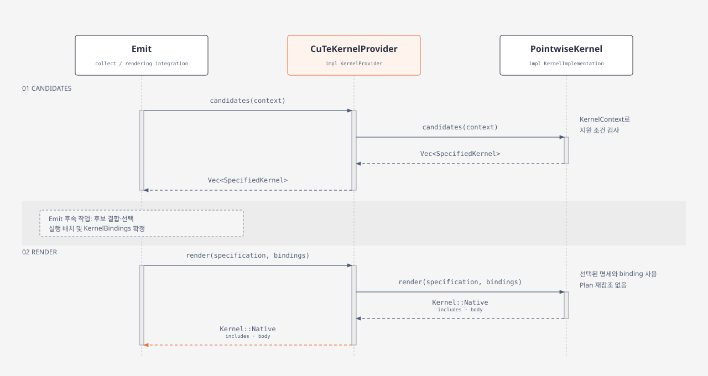
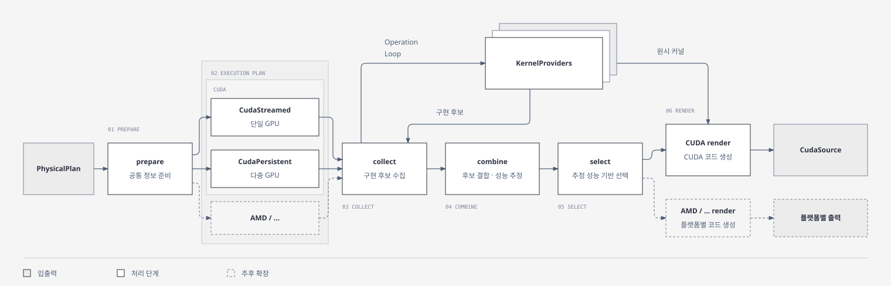

# Emission

[`PhysicalPlan`](planning.md)에 표현된 연산과 Loop 구조에 맞는 구현을 선택하고,
선택된 구현을 결합하여 실행 계획과 코드를 생성한다.

공통 `analysis/regions.rs`는 원본 region과 모든 관측 입출력·def-use를 제공한다.
Provider는 이를 받아 자신의 패턴/API 지원 여부를 검사한다. GEMM·정규화·RoPE 인식은
`emit/provider/quack/recognition`이 소유한다. Quack 분류/summary의 성공을
Triton/CuTe 후보의 필수 관문으로 두지 않는다. 후보 pipeline은 전체 region coverage,
reference 정확성, packing/copy를 포함한 실행 비용과 선택을 담당한다.
구체 경계는 [Planning](planning.md#연산-패턴-분류)을 따른다.

현재 [`emit()`](../../src/emit/mod.rs)은 prepare → provider 선택 → combine → CUDA 실행 배치
→ region 검증 → render를 거쳐 Native Streamed `CudaSource`를 반환한다. Hopper·sm_89·sm_120의
pointwise/reduction/GEMM과 Register 결합을 지원한다. Persistent와 Native/Opaque 통합 실행은 후속 설계다.
별도로 `kernel_candidates`와 `emit_python`의 제한된 Triton/Quack host-call 경로는 구현되어 있다.
설명과 검증 범위를 구분하며, [Triton provider의 진입점 표](triton-provider.md#selection-boundary-and-current-limits)가 경로 비교의 원본이다.

`emit/mod.rs`의 공개 CUDA 진입점은 `native::emit`에 위임한다.
`native/collect.rs`가 구현을 수집하고 `native/combine/`과 `native/cuda/`가 조합·출력을 처리한다.
Python 프로그램 구성은 `emit/wrapper/`에 있으며, 공개 `PythonProgram`/`emit_python` API는 유지한다.
CuTe·Triton·Quack 구현은 모두 `emit/provider/`에 있고, Triton lowering/codegen도 해당 provider 안에 있다.

## 문서 구성

- [Kernel Providers](emission/kernel-providers/README.md): Native/Opaque 구현과 선택 정책 안내.
- [Hardware Architecture](emission/hardware/README.md): 하드웨어별 실행 배치 안내.
- [Quack provider](quack-provider.md): 영역별 API 지원 검사·packing·호출 및 비교 경로.
- [Triton provider](triton-provider.md): 공통 plan에서 Triton source/launch까지의 별도 경로.

## 대상 하드웨어

현재 Native Streamed CUDA 경로는 Hopper, sm_89, sm_120을 지원한다.
각 연산의 dtype·tile·layout 지원 판정은 provider에서 수행한다.
Persistent/통신은 현재 새 emitter의 실행 지원 범위에 포함되지 않는다.
Triton의 target/config와 검증 범위는 [provider 문서](triton-provider.md)를 따른다.

## 현재 진입점과 설명 범위

- `emit`: 현재 CuTe만 등록한 Native CUDA 경로. BF16/FP32, single-GPU streamed이며 split loop는 거절한다.
- `emit_triton`: 공통 plan 전체를 Triton program provider로 전달한다.
- `kernel_candidates`: CuTe/Triton/Quack 후보를 operation별로 열거한다. 실행·승자 선택은 하지 않는다.
- `region_candidates`: 원본 region/facts를 각 matcher에 전달하고 전체 region의 Triton/Quack 후보를 열거한다. 의미 summary는 선택적이다.
- `emit_python`: 지원되는 독립 operation 또는 전체 scheduled region의 정확성·시간 비교 프로그램을 만든다.
  영역 비교 조건이 맞지 않으면 기존 Triton 직접 실행으로 연결한다. Native 후보는 아직 비교 실행하지 않는다.
- `emit_python_executable`: 원본 region마다 구현 하나를 고정하고, 필요한 Triton/Quack 함수와
  allocation·호출만 포함하는 최종 `forward()` 파일을 만든다. 선택 보고서는 source와 별도로 반환한다.

아래 Native 명세·조합·Streamed 설명과 Persistent/통합 Opaque의 후속 설계를 구분한다.
현재 공개 함수는 [emit/mod.rs](../../src/emit/mod.rs), 후보는
[candidate.rs](../../src/emit/candidate.rs), Python 분기는 [wrapper/mod.rs](../../src/emit/wrapper/mod.rs)에 있다.

## 선택 완료된 Python 실행 파일

[`emit_python_executable(plan, selection)`](../../src/emit/wrapper/finalized.rs)은 다음 경로다.

```text
scheduled IR → 공통 PhysicalPlan / RegionFacts
  → 전체 region 후보와 지원·거절 이유
  → PythonSelection으로 region별 구현 하나 고정
  → provider의 PythonKernel (함수 source + entrypoint + 순서 있는 value ID 인자)
  → 공통 wrapper: 입력 검사 → Global/External allocation → 원본 순서의 호출 → 모든 출력
  → PythonExecutable { source, report, providers }
```

`PythonSelection`은 `PreferQuack`, `TritonOnly`, `Regions(Vec<PythonProvider>)`다.
기본 `PreferQuack`은 지원되는 Quack을 우선하는 **지원 정책**이며 성능 비교 결과가 아니다.
외부에서 비교·검증한 region별 선택은 `Regions`로 전달할 수 있다. 현재 비교 프로그램의
결과를 자동으로 읽어 최종 파일까지 재생성하는 연결은 구현하지 않았다. 명시적 선택이
미지원이면 오류를 반환한다. 실행 중 선택한 Quack 호출이 실패해도 몰래 Triton으로 바꾸지 않는다.

Provider와 공통 wrapper의 책임은 다음과 같다.

| 위치 | 책임 |
| --- | --- |
| [provider/python.rs](../../src/emit/provider/python.rs) | provider 내부 결과 계약: 함수·imports·공유 helper·공통 value ID 인자 |
| [triton/codegen/region.rs](../../src/emit/provider/triton/codegen/region.rs) | 선택된 kernel/config/prune와 `_run_triton_N` launch 함수; 기존 본문과 launch 로직 재사용 |
| [quack/finalized.rs](../../src/emit/provider/quack/finalized.rs) | 증명된 명세의 API/view/packing/copy를 `_run_quack_N`으로 구체화; 필요한 분기만 source에 포함 |
| [wrapper/finalized.rs](../../src/emit/wrapper/finalized.rs) | 선택과 전체 memory boundary 검사, ABI 이름, allocation, 모든 region의 순서, 출력·입력 갱신 보존 |

최종 파일에는 `_MANIFEST`, `_SPEC`, JSON 해석, reference, 후보 benchmark, factory namespace가 없다.
분석·후보·선택 보고서는 `report()`에만 남는다. 입력 CUDA capability·shape·dtype·contiguity와
alias 계약은 `forward()`에서 검사한다. Quack API는 해당 함수에서 import하며 첫 호출에 JIT될 수 있고,
Triton은 기존 autotune 설정을 유지한다. 이 library 내부 tuning과 provider 간 비교는 별개다.

입력과 동일한 output은 새로 할당하지 않는다. 여러 output은 plan의 binding 순서대로 tuple로
반환하고, 입력 mutation은 원래 buffer에서 진행한다. Register 중간값을 global buffer로 만들지 않는다.
이는 공통 조합 지원이며 **Quack이 다중 출력·mutation region을 지원한다는 뜻은 아니다**.
그 region 전체는 Triton에 남는다. Norm·RoPE의 API output copy, 별도 gate/up packing 등
기존 adapter의 준비 비용도 함수 안에 그대로 남는다.

현재 범위는 고정 shape의 single GPU이며 CUDA native/CuTe artifact 조합은 포함하지 않는다.
Cross-region split tuning은 이 경로에서 거절하며 기존 `emit_triton`으로 생성할 수 있다.
Triton 분석은 아직 전체 program 단위이므로 한 region의 lowering 실패가 다른 region의
Triton 후보 발견에도 영향을 줄 수 있다. Quack matcher의 원본 region 검사는 계속 수행한다.

직접 파일 생성은 다음과 같다. Python frontend/optimizer 연결은 필요하지 않다.

```sh
cargo run -p trinity-lowering --locked --bin emit_python -- input.ir output.py \
  --target sm120 --dtype bf16 --selection prefer-quack
```

`--selection triton`은 전체 fallback, `--providers quack,triton,...`은 모든 원본 region의
명시적 선택이다. `--bindings config.json`은 선택적으로
`{"shapes":{"W":[64,64]},"symbols":{"M":32},"dtypes":{"W":"bf16"}}`를 받는다.
결과는 `output.py`와 `output.selection.json`이며 파일을 import한 뒤
`forward(**inputs)`를 호출한다. 기본 CLI 설정은 SM120/BF16이다.

구조/coverage/ABI/CLI, library 호출, GPU 실행과 독립 reference 정확성은 각각 구분해
확인해야 한다. 이번 구현 중 추가한 테스트와 Llama/SwiGLU fixture는 2026-09-26 정리에서
삭제했다. 최종 실행 파일 경로의 전용 회귀 테스트는 이후 다시 작성할 예정이다.

## Kernel

Kernel은 Provider가 Operation과 Loop 문맥에 맞춰 제공하는 구현 결과다.
원시 커널 하나가 독립적으로 launch 가능한 CUDA kernel 하나를 의미하지는 않는다.
전체 Operation의 원시 커널을 선택한 뒤, 별도 결합 단계에서 실제 실행할 본문을 구성한다.

### Native / Opaque

| 종류 | 제공하는 정보 | 결합과 실행 |
| --- | --- | --- |
| Native | 조합 가능한 본문, 입출력·자원·동기화 요구 | 호환되는 같은 provider의 Native와 결합. 현재 Streamed; Persistent는 후속 설계 |
| Opaque | 완성된 kernel의 artifact, 인자·launch 계약, 외부 메모리 접근 정보 | 제한된 Python host-call 경로로 실행. Native CUDA 경로와의 통합은 미구현 |

Native의 계산 본문은 일반 CUDA kernel의 block과 Persistent kernel의 Worker CTA에서
공통으로 사용할 수 있도록 실행 배치와 분리한다.

### 처리하는 Operation과 Loop 문맥

구현 결과는 자신이 처리하는 Operation 목록을 명시한다. 결합 후에도 이 정보를 유지해
원래 프로그램의 연산이 누락되거나 중복 실행되지 않는지 확인한다.

Loop 처리 범위는 Operand의 접근 범위와 전달된 Loop 문맥으로 결정한다. 별도의 Loop
소유 범위 선언을 추가하지 않는다. Loop를 Emit이 생성할지 구현 내부에서 처리할지는
Emit과 Provider 사이의 구현 계약에서 다룬다.

### 실행·자원 요구사항

구현 결과는 thread 구성, 구현 내부의 타일 크기·용량, pipeline, 임시 메모리,
alignment와 동기화 등 선택·결합·실행 배치에 필요한 요구사항을 제공한다.
현재 Native 필드는 `KernelRequirements`/`KernelInterface`에 있다. 외부 artifact를 같은 실행 계획에 넣는 계약은 후속 설계다.

논리적인 타일과 접근 범위는 Plan의 expression과 Loop를 따른다. Loop의 step은
반복 사이의 이동량이고 tile index의 width는 접근 폭이므로 두 값을 동일하게 취급하지 않는다.

### Thread 참여 계약

`KernelRequirements.thread_policy`는 구현 본문이 허용하는 thread 참여 방식을 명시한다.

| 계약 | 실행 제약 | 현재 구현 |
| --- | --- | --- |
| `FullCta { threads }` | 지정된 크기의 CTA 전체가 참여한다. CTA barrier를 사용할 수 있다. | Hopper/SM80 GEMM |
| `Flexible { supported }` | 지원 목록의 어느 크기로든 전체 CTA가 참여할 수 있다. 목록 순서는 선호도를 뜻하지 않는다. | 메모리 입력 pointwise |
| `Subgroup { threads }` | CTA의 앞쪽 N개 thread만 참여한다. N은 warp 크기의 배수이며 CTA barrier를 사용하지 않는다. | Warp 단위 reduction |
| `FollowInput` | 독립 thread 수를 요구하지 않고 Register 생산자의 thread·좌표·출력 scope를 따른다. | Register 입력 pointwise |

개별 `SpecifiedKernel`은 지원 제약만 보관한다. Fusion 중에는 같은 Provider의 연속 연산이
허용하는 CTA 크기의 교집합을 유지하고, 공통 크기가 있는 동안 하나의 묶음으로 구성한다.
공통 크기가 없거나 Provider가 바뀌면 본문을 분리한다. Register 전달을 위해 storage를
바꾸지는 않는다.

묶음이 확정되면 `choose_block_threads()`가 최종 CTA 크기를 한 번 선택해
`CombinedBody.requirements.block_threads`에 저장한다. 현재 정책은 128이 가능하면 128,
그렇지 않으면 가능한 최소 크기다. 성능 기반 선택은 이 단계에서 확장한다.
선택 과정은 개별 명세를 수정하지 않는다.

확정된 크기를 `SpecifiedKernel::interface(block_threads)`에 전달해 Register layout과
연결을 검증하고, `KernelBindings.block_threads`로 renderer에 전달한다. Provider는 이
크기로 layout과 본문을 생성해야 하며, 나머지 자원 요구사항은 지원하는 모든 크기에서
유효해야 한다. CTA 크기 결정 전의 Loop 처리는 크기와 무관한 `iteration()` 계약을 사용한다.

큰 CTA 안의 Subgroup 호출은 prologue·전체 누적 loop·epilogue와 Register continuation까지
하나의 참여 조건으로 감싼다. 본문 내 root 사이의 CTA barrier는 이 조건 바깥에 둔다.
GEMM의 CTA barrier를 부분 그룹 barrier로 자동 치환하거나 thread 사이의 Register 값을
자동 재분배하지 않는다. Streamed와 Persistent는 동일한 참여 계약을 사용한다.

## KernelProvider



[공통 `KernelProvider`](../../src/emit/provider/mod.rs)는 `name()`과 `candidates()`만 요구한다.
Triton·Quack의 opaque 후보는 Native phase/layout/CTA binding 계약을 구현하지 않는다.

[`NativeKernelProvider`](../../src/emit/native/mod.rs)는 이와 별도의 Native 조합 능력이다.
`specify()`가 단일 `SpecifiedKernel` 또는 미지원·오류를 반환하고, `render()`는 확정된
`KernelBindings`로 prologue/mainloop/epilogue를 생성한다. 반환 타입 `native::Kernel`은
Native phase만 담으며 Opaque placeholder가 없다. CuTe는 두 trait을 모두 구현하고
`candidates()`에서 자신의 Native 명세를 후보로 감싼다.

`KernelInterface`, register layout, thread 참여, register binding, `KernelCode`는
`emit/native/`가 소유한다. `native/access.rs`는 공통 `TensorAccess`를 Native 조합용
접근/port 표현으로 변환한다. 공통 값·view 의미를 다시 정의하는 분석기가 아니다.
구현 선택은 Emit의 책임이며 IR Reader와 `PhysicalPlanBuilder`는 구현을 선택하지 않는다.
그림의 specify/render는 이 Native 전용 계약에 해당한다.

### 입력 문맥

Operation의 expression·Operand, 값의 dtype·shape·storage, 이를 감싸는 Loop와
실행 순서, target과 요청된 실행 방식을 전달한다.
Provider는 입력에 정해진 연산 의미와 논리적인 Loop·접근 범위를 보존해야 한다.

Single GPU용 텍스트 IR과 Builder는 공통 Plan 모델을 사용한다. Multi-GPU 의미를 Builder로 표현할 수 있어도 현재 새 `emit`는 `world_size != 1`을 거절한다.
통신용 텍스트 IR 및 Persistent 실행 연결은 후속 작업이다. Builder의 `all_gather` expression은
통신 의미를 전달하며, peer push/pull이나 NVLS 같은 구현 선택은 Provider에서 다룬다.
표현과 rank별 배치는 [Planning](planning.md#statement와-연산)을 따른다.

### Native 선택 정책

이 절은 `emit/native/collect.rs`의 Native 경로를 설명한다. `kernel_candidates`의 후보 보존 및 Python의 정확성·시간 비교와 구분한다.

각 Operation마다 Provider를 등록된 우선순위대로 시도하고, 처음 지원하는 Provider의 구현
하나를 선택한다. 하나의 Plan에서 서로 다른 Provider를 사용할 수 있다.
모두 미지원이면 해당 Operation과 Provider별 미지원 사유를 `EmitError::NoProvider`로
반환한다. Provider 내부 오류는 `EmitError::Provider`로 즉시 전달한다.
구현 선택 중에 주변 연산과의 결합까지 확정하지 않는다.

요청된 실행 방식에 대한 지원 여부도 선택 조건에 포함한다. Persistent 요청에서는
Opaque를 선택 대상에서 제외한다. Opaque를 사용하기 위해 실행 방식을 바꾸거나
Persistent 프로그램을 분할하는 정책은 이번 범위에서 제외한다.

## 커널 결합

전체 Operation의 원시 커널 선택이 완료되면, Loop 구조와 실행 순서에 따라 선택된 구현들을
조합한다. IR에서 이미 fusion된 프로그램이어도 실제 구현들의 결합 가능성을 검사한다.
하나의 결합 본문에는 같은 Provider의 구현만 포함한다. Provider가 바뀌는 지점에서 본문을
나누며 Inter-KernelProvider combine은 지원하지 않는다. Provider의 이름이 같아도
등록 항목이 다르면 별도 Provider로 취급한다. 메모리로 연결할 수 있는 본문은 분리하고,
Register처럼 같은 본문이 필요한 전달이 Provider 경계를 넘으면 결합 실패로 처리한다.
`combine()`은 선택된 명세들을 한 번 결합해 단일 `CombinedPlan`을 반환한다.
연산별 후보의 Cartesian product를 만들거나 여러 결합 결과를 열거하지 않는다.

### 결합 조건

- 연산 순서, 의존성과 누적값의 초기화·갱신·최종 저장 시점을 보존한다.
- 중간값의 dtype·layout·storage와 전달 방식이 호환된다.
- thread 구성과 필요한 동기화를 함께 제공할 수 있다.
- 결합한 구현의 자원 요구가 target과 실행 방식의 제약을 만족한다.

초기 구현에서는 결합 실패를 이유로 원시 커널 선택을 다시 탐색하지 않는다. 분리 실행이
유효하면 선택된 구현들을 별도로 사용한다. 같은 kernel에서 실행되어야 하는 프로그램은
결합할 수 없으면 미지원으로 처리한다. 이 과정에서 storage를 임의로 바꾸지 않는다.

### Prologue / Mainloop / Epilogue

결합 단계는 반복 전에 한 번 수행할 처리, 반복 본문, 반복 후 처리를 함께 구성한다.
예를 들어 GEMM의 누적값 초기화, K 반복, 최종 저장과 뒤따르는 pointwise 처리를
지원 조건에 따라 조합한다.

Bias나 activation은 Plan에 있는 Operation이고, 누적값 초기화나 pipeline 준비는
구현체가 생성하는 처리다. 결합 결과는 두 종류를 구분하고 처리한 Operation을 추적한다.

Prologue와 epilogue는 해당 Loop를 기준으로 배치한다. K Loop의 초기화는 출력
타일마다 수행되어야 하므로, 중첩 Loop 전체를 하나의 전역 3단계로 평탄화하지 않는다.

### 누적값 초기화

[Planning의 초기화 규약](planning.md#초기화수명-분석의-범위)에 따라 인식된 누적은 각 출력 타일에서
암묵적으로 0부터 시작한다. 별도의 초기화 Operation을 요구하지 않으며, Emit이 해당 순차
Loop에 진입하기 전에 초기화를 생성한다.

일반적인 `load(dst) + rhs`를 모두 0에서 시작하는 누적으로 해석하지 않는다.
Scheduled `Region` 경로에는 이미 `Operation::zero_init`와 earlier producer 정보를 보존하는
규약이 있다. Region 밖 Builder의 좁은 zero-start 규약과 다르므로
[Planning의 초기화 범위](planning.md#초기화수명-분석의-범위)를 따른다.
새 Native provider가 source recurrence를 처리할 때 seed를 다시 0으로 추정하지 않는다.

### Shared / Register의 범위와 수명

실제 저장 범위와 수명은 결합 단계에서 검사한다. 생산자와 소비자가 같은 유효 범위에
있는지, 필요한 전달과 동기화가 가능한지, 마지막 사용까지 값이 유지되는지 확인한다.
결합하지 않은 원시 커널에도 동일한 검증을 적용한다.

같은 kernel 안에 있다는 사실만으로 전달이 보장되지는 않는다. Shared 값은 해당 block의
범위를 따라야 하고, Register 값의 thread 간 전달에는 이를 지원하는 구현이 필요하다.
단일 Operation statement 자체는 kernel launch가 아니다. Scheduled `Region` 경계는 별도로 보존된다. Plan의 일관성 검사와 Native 조합의 실제 layout·수명 검사는 둘 다 필요하다.

## 실행 계획

결합된 본문을 실제 실행 단위에 배치하고, 임시 메모리·동기화·kernel 간 의존성과
launch 구성을 확정한다. 구현에 종속적인 자원 배치는 선택과 결합 결과를 반영한다.

### Streamed

일반 CUDA kernel의 grid에 작업을 배치하고, kernel 간 실행 순서로 의존성을 보장한다.
현재 구현은 Native만 지원한다. 상수 parallel domain을 직사각형 grid로 평탄화하고
CTA마다 좌표를 계산한다. 일반 sequential loop는 CTA 안에 남기며 하위 본문의 thread 수가
일치해야 한다. 의존적인 bound와 sequential 내부 parallel loop는 미지원이다.

실행 배치는 kernel별 thread·shared scratch와 buffer alignment를 확정한다. Region 검증은
좌표를 CPU에서 방문해 중간값의 coverage와 CTA 간 read/write·write/write 충돌을 검사한다.
최종 출력 coverage도 확인한다. CUDA에 좌표별 테이블을 생성하지 않으며, 계산 본문은
binding·좌표·scratch를 받는 device 함수로 wrapper와 분리한다.

큰 grid는 block base를 갖는 여러 launch로 나누고 동일 stream에서 순서대로 제출한다.
`CudaRequirements`의 thread/shared 필드는 kernel별 요구의 최댓값이며 실제 launch는
각 kernel의 값을 사용한다. Host ABI v1은 유지한다. Opaque launch는 후속 작업이다.

### Persistent

Native 본문을 Worker CTA에서 실행하도록 작업과 인자, 의존성을 구성한다.
작업 dispatch와 완료 처리는 Persistent 실행 방식의 책임으로 둔다.

## CudaSource

[`CudaSource`](../../src/compile/source.rs)는 생성된 CUDA 코드와 실행에 필요한 자원
요구사항을 담는 현재 컴파일 입력이다.

```rust
pub struct CudaSource {
    code: String,
    requirements: CudaRequirements,
}
```

### `code`

확정된 본문과 실행 계획에서 생성한 CUDA 소스다.
코드 생성 단계에서 구현을 다시 선택하거나 결합 가능성을 다시 판단하지 않는다.

### `requirements`

Target과 rank 수, 버퍼 binding, workspace, shared memory, thread 구성과
통신 기능 등 컴파일과 실행에 필요한 조건을 전달한다.

현재 `CudaSource`는 CUDA 소스와 자원 요구사항을 담는다. Opaque artifact까지 전달하는
반환·compile·runtime 계약은 실제 외부 kernel 연동 단계에서 별도로 확정한다.

## 처리 경로



공통 [`prepare`](../../src/emit/prepare.rs)는 확정된 PhysicalPlan을 참조하고
configuration symbol이 bound 상태인지 검사한다. 값의 dtype·shape·storage와 Loop/순서는
이미 common plan이 소유한다. 이 단계는 CUDA allocation 크기나 launch slot을 만들지 않는다.

현재 Native 경로는 `native::emit` 안의 `prepare` → `collect` → `combine` → `cuda::emit`이다.
`collect`는 Native provider만 받는다. `cuda::emit` 내부에서
[`native/bindings`](../../src/emit/native/bindings.rs)가 단일 출력·불변 입력 ABI 조건,
External/Global 버퍼의 row-major strides, bytes, slot과 기본 alignment를 준비한다.
이후 CUDA 실행 배치가 구현의 alignment/shared resource 요구를 반영하고 render가
실제 pointer/index 표현과 launch wrapper를 조립한다. 독립 Triton/Quack 후보 열거는
이 Native buffer 준비를 거치지 않는다. 각 단계의 타입은 해당 소스가 원본이다. 실행 배치 이후의 코드 생성과
출력은 플랫폼별로 분리한다. CUDA 경로는 CUDA render를 거쳐 `CudaSource`를 생성한다.
점선은 AMD 등 다른 플랫폼의 실행 배치·render·출력을 추가할 확장 경로이며,
해당 플랫폼의 구체적인 코드 생성과 출력 계약은 후속 설계에서 정한다.

## 검증 책임

| 구분 | 검증하는 내용 |
| --- | --- |
| 상위 입력 생성 단계 | Loop 범위와 메모리 접근의 유효성 |
| Plan | 참조, binding과 실행 순서 등 내부 일관성 |
| 원시 커널 선택 | 구현별 dtype·정렬·타일·실행 방식 지원 조건 |
| 커널 결합 | Operation 누락·중복, 값의 전달·수명, 초기화·갱신·최종 저장, 결합 가능성 |
| 실행 계획 확정 | 실제 배치에서의 자원 제약, 동기화, kernel 간 의존성과 launch 구성 |

## 다음 단계

Native Streamed의 소스 생성·compile/runtime 연결을 바탕으로 GPU 수치 검증,
일반 실행 분석의 확장, Shared 전달과 통신, 동일 Native 본문의 Persistent 실행 순서로 확장한다.
Opaque의 제한된 Python wrapper 경로는 존재한다. Native 실행 계획에 외부 artifact를 결합하는 반환·동기화·runtime 계약과 공통 benchmark 연결은 아직 후속 작업이다.
Quack/CuTe 연결에서 먼저 확인할 계약과 남은 제한은
[Triton provider의 재사용 경계](triton-provider.md#reuse-by-quack-and-cute)를 따른다.

생성한 `CudaSource`는 [`compile`](../../src/compile/mod.rs) 단계에 전달한다.

[Architecture 안내](README.md)는 전체 단계의 진입점이다. 이전 전체 lowering 설명은
upstream 문서 정리에 따라 삭제되었으며 Git 이력에서 확인할 수 있다.
공통 사실의 원본은 [Planning](planning.md), 구현 선택·조합은 이 문서와
[provider 연결](triton-provider.md)을 따른다. 이 문서의 후속 설계는 구현 완료를 뜻하지 않는다.
