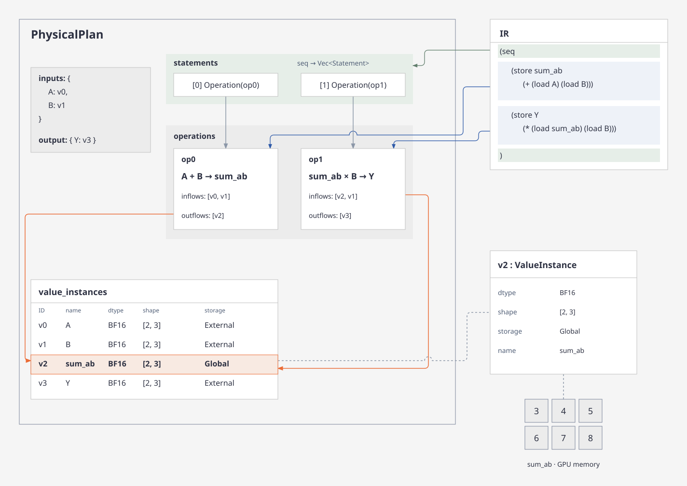
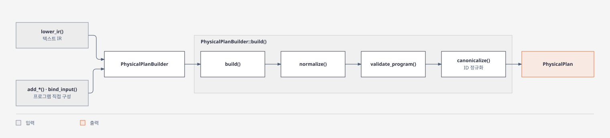

# Planning

텍스트 IR 또는 직접 Builder 호출로 전달된 텐서, 연산, Loop 구조를 `PhysicalPlan`으로 표현한다.

## PhysicalPlan

[`PhysicalPlan`](../../src/plan/mod.rs)은 입력으로 전달된 텐서, 연산, Loop 구조와
실행 순서를 표현하는 자료구조다.

입력에 정해진 연산과 실행 구조를 유지하며, 이후 lowering에 필요한 정보를 직접 소유한다.

```rust
pub struct PhysicalPlan {
    /// `PhysicalPlan`의 하드웨어 사양을 표현
    target: TargetCapability,
    /// 프로그램 실행에 참여하는 rank 수를 표현
    world_size: usize,

    inputs: Box<[TensorBinding]>,
    output: TensorBinding,

    value_instances: IdVec<ValueInstanceId, ValueInstance>,
    operations: IdVec<OperationId, Operation>,
    statements: Vec<Statement>,

    /// 컴파일 cache key로 사용
    hash: u64,
}

#[derive(Debug, Clone, PartialEq, Eq, PartialOrd, Ord, Hash)]
pub struct TensorBinding {
    tensor: String,
    value: ValueInstanceId,
}
```



### `inputs`, `output`

프로그램 실행에 필요한 외부 입력 Tensor의 목록이다.

예를 들어 `Y = A + B` 프로그램의 경우,`inputs`에 `A`와 `B`, `output`에 `Y` 텐서가 할당된다.

각 항목은 `TensorBinding`으로, 입력 텐서의 이름(`tensor`)과 프로그램 안에서
그 텐서를 참조하는 값의 ID(`value`)를 담는다.

### `value_instances`

프로그램의 모든 Tensor 정보를 `ValueInstanceId`를 key로, `ValueInstance`를 value로 저장한다.

```rust
pub struct ValueInstance {
    dtype: DType,
    shape: Box<[usize]>,
    /// Tensor 저장 위치
    storage: Storage,
    name: Option<String>,
}
```

`storage`의 각 값은 다음을 표현한다.

| 값         | 의미                                 |
| ---------- | ------------------------------------ |
| `External` | ABI binding으로 연결된 입출력 Tensor |
| `Global`   | Device global memory                 |
| `Shared`   | CTA body 내 shared-memory tile/panel |
| `Register` | CTA body 내 register 값              |

- 다른 스케줄에 위치한 작업 사이 Tensor는 `External` 또는 `Global`에 위치해야 한다.
- `Shared/Register` 값의 `shape`는 기존 rank-local shape를 유지해야 한다.

### `operations`

`Operation`은 `PhysicalPlan` 내 메모리 상태 변경을 표현하는 단위로, 해당 변경에
필요한 읽기와 연산을 포함한다.

```rust
pub struct Operation {
    // Tensor Read
    inflows: Vec<ValueInstanceId>,
    // Tensor Write
    outflows: Vec<ValueInstanceId>,
    /// 계산, 통신, 또는 메모리 접근 표현식
    expression: Expression,
}
```

연산의 실행 순서와 이를 감싸는 Loop 구조는 `statements`에 담는다.
구현체는 Plan에 저장하지 않는다. Emit에서 Operation과 Loop 문맥을 받아 선택한다.

계산은 `store` expression으로 표현한다. 단일 연산을 본문으로 가지는 순차 Loop에서
`store(dst, load(dst) + rhs)`의 목적지 접근이 반복 변수에 의존하지 않으면 reduction으로
인식한다. 이 누적은 0에서 시작하며, 목적지의 초기 load는 외부에서 읽을 inflow가 아니다.
이전 store가 있더라도 해당 값을 초깃값으로 사용하지 않는다. Emit이 Loop 진입 시
초기화를 생성하며, 일반적인 목적지 읽기는 여전히 앞선 producer가 필요하다.

Builder의 all-gather는 다음 expression을 사용한다. 텍스트 IR Reader의 통신 문법은
아직 지원하지 않는다.

```text
(all_gather <source-view> <source-index> <destination-view> <destination-index> <axis>)
```

`axis`는 0부터 시작하는 텐서 차원 번호이며, 참여 rank 수는 Plan의 `world_size`를 따른다.
Destination index는 rank 0의 데이터가 들어갈 기준 영역이다. Source rank `r`의 데이터는
gather axis에서 `r × source의 전체 axis extent`만큼 이동한 영역에 배치된다. 따라서
Loop가 source의 일부 tile만 순회하더라도 결과는 전체 텐서 기준 rank 순서를 유지한다.
이 expression에는 peer push/pull, NVLS 같은 구현 선택을 포함하지 않는다.

### `statements`

입력에 명시된 최상위 실행 순서를 담는 목록이다. 각 항목은 연산 ID를 참조하는
[`Statement::Operation`](../../src/plan/statement.rs)이거나, 내부 실행 목록을 가진 `Statement::Loop`다.
연산 목록만으로는 표현할 수 없는 반복 범위와 중첩, 연산 사이의 순서를 담기 위해 둔다.

`Loop`의 `kind`는 병렬·순차 반복을 구분하고, `domain`은 반복 변수와
`start/stop/step`을 표현한다. `body`는 Loop 안에서 실행할 `Statement` 목록이다.
예를 들어 입력에 GEMM의 M/N 병렬 Loop와 그 안의 K 순차 Loop가 있으면,
그 중첩과 누적 연산의 위치를 그대로 표현한다.
이 구조를 바탕으로 이후 lowering이 Task와 CTA 내부 계산의 경계를 정한다.
Statement 하나가 kernel launch 하나를 의미하지는 않는다.

## 입력 경로



[`lower_ir()`](../../src/plan/ir.rs)는 텍스트를 파싱하고 tensor·symbol을 연결한 뒤,
명시된 Loop와 expression을 [`PhysicalPlanBuilder`](../../src/plan/builder.rs)에 등록한다.

반복 범위와 메모리 접근의 유효성은 IR 또는 Builder 입력을 생성하는 상위 단계가 보장한다.
Plan은 전달된 프로그램의 참조, 바인딩과 실행 순서 등 내부 일관성을 검증한다.

직접 `PhysicalPlanBuilder`에 값을 직접 전달하여 `PhysicalPlan`을 구성할 수 있다.

## 다음 단계

구성된 Plan은 [Emit 파이프라인](emission.md#처리-경로)에 전달한다.
