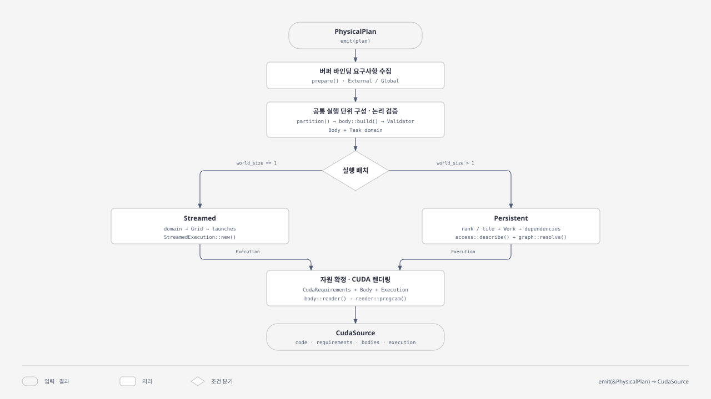

# Trinity lowering 아키텍처

Emit 재구성에서 합의한 Plan·구현 선택·커널 결합의 책임과 처리 순서는
[Emit 재구성](emission.md)에 정리한다. 아래에는 이전 emitter의 구현 설명이 포함되어 있다.

`trinity-lowering`은 선택된 연산 구현과 실행 순서를 담은 `PhysicalPlan`을 CUDA 소스와
컴파일 artifact로 변환한다. 이 문서는 현재 구현의 **`PhysicalPlan → emit() → CudaSource
→ compile() → CudaArtifact`** 경로를 중심으로 인터페이스와 코드 흐름을 설명한다.

같은 계산 본문을 일반 CUDA kernel의 block과 Persistent kernel의 Worker CTA에서
사용할 수 있도록, **계산 내용과 실행 배치를 분리**한다. CTA는 CUDA thread block이다.


[전체 구성도 SVG](../images/trinity-lowering-architecture.svg).
위 그림은 책임 단위를 나타낸다. `공통 CUDA lowering`과 실행 배치는 실제로
`cuda::prepare()` 안에서 연결되며, `CUDA 생성 · 컴파일`은 별도 공개 API인 `emit()`과
`compile()`을 요약한 것이다. Native runtime은 이 문서가 다루는 컴파일 경로의 다음 소비자다.
기존 그림의 점선 노드는 LLM이 담당하는 입력 구성 코드를 표시한다.

## 1. 인터페이스

```rust
// 텍스트 IR로부터 plan 구성
pub fn lower_ir(
    text: &str,
    config: &IrConfig,
) -> Result<Vec<PhysicalPlan>, IrError>;

// 값·연산·실행 순서를 직접 구성하는 Builder
pub struct PhysicalPlanBuilder { /* ... */ }

// CUDA 소스 및 실행·자원 정보 생성
pub fn emit(plan: &PhysicalPlan) -> Result<CudaSource, EmitError>;

// 생성된 소스의 compile/link
pub fn compile(source: CudaSource) -> Result<CudaArtifact, CompileError>;
pub fn compile_with_config(
    source: CudaSource,
    config: &CompileConfig,
) -> Result<CudaArtifact, CompileError>;
```

## 2. 코드 흐름

### 2.1. 다이어그램 선택

전체 구성은 앞의 **Architecture** 도식으로, 내부 처리 순서와 실행 방식 분기는 아래
**Flowchart**로 표현한다. 이 흐름에서 독자가 확인할 핵심은 `world_size`에 따른 두
배치 경로와 CUDA 렌더링으로의 합류다. Sequence는 함수 사이의 호출·반환을 상세히
추적할 때, Process는 분기 없는 상위 단계만 요약할 때 적합하다.

아래 그림은 기존 도식의 밝은 배경·글꼴·직각 연결선을 따르는 `doc-wide` 크기
1280 × 720의 정적 Flowchart다. 9개 노드에 성공 경로를 표시하며, backend 세부 호출,
오류 반환, 선택적 fusion과 native 실행은 본문에서 다룬다.



[코드 흐름 SVG](../images/trinity-lowering-code-flow.svg)

그림의 박스는 처리 책임을 요약하며 모두 공개 함수인 것은 아니다. Body는 분기 전에
생성되어 렌더링까지 유지된다. 두 경로는 서로 다른 `Execution` 값을 생성하며 동시에
실행되지 않는다. 또한 실제 구현은 overflow를 조기에 거부하기 위해 Streamed의
`Grid::new()`를 Body 생성·논리 검증보다 먼저 호출한다.

### 2.2. Plan 확정과 선택적 fusion

입력 경로, Plan 확정 과정과 데이터 모델은 [PhysicalPlan](planning.md)에서 설명한다.

호출자가 [`fuse()`](../../src/fusion/mod.rs)를 사용하면 원본 Plan을
첫 후보로 유지하고 인접 Statement의 합성과 storage 승격 후보를 열거한다. 각 후보는
다시 Plan을 확정하고 `emit::validate()`로 검증한다. 이 검증은 공통 binding 준비와
플랫폼 prepare를 재사용하며 최종 CUDA 문자열은 렌더링하지 않는다.

### 2.3. emit 진입과 버퍼 요구사항 수집

[공통 `emit()`](../../src/emit/mod.rs)은 먼저
[`prepare(plan)`](../../src/emit/prepare.rs)을 호출한다.
`build_bindings()`는 값별 입력 alias, 출력 이름, dtype·shape·row-major stride·바이트 수를
수집하고 `External/Global` 값에 dense launch slot을 부여한다. 버퍼 요구사항과
value ID → slot 매핑은 `BufferBindings`에 함께 보관한다.
`Shared/Register` 값은 외부 버퍼 목록에 포함하지 않는다.

공통 `prepare()` 안에서 target에 따라 [`cuda::prepare(plan, bindings)`](../../src/emit/cuda/prepare.rs)로
분기한다. CUDA prepare가 값 제약 검사, domain·Body 구성, 논리 검증과 실행 배치를 조립한다.
이 시점에는 GPU 버퍼를 할당하지 않고, runtime이 사용할 요구사항만 계산한다.

공통 prepare는 플랫폼의 준비 결과를 `Box<dyn PreparedProgram>`으로 반환한다.
`render(self: Box<Self>)`는 준비 결과를 소비하여 내부 `EmittedSource`를 반환한다.
alignment·symmetric까지 확정된 버퍼 요구사항은 준비 결과가 소유하고 최종 source로 이전한다.
공개 `emit()`은 `prepare(plan)?.render()?`의 `EmittedSource::Cuda`에서 기존 `CudaSource`를 꺼낸다.
fusion의 `emit::validate()`는 `prepare(plan)`의 성공 여부만 확인한다.

### 2.4. Task domain 분리, Body 합성과 논리 검증

[`Task`](../../src/emit/cuda/domain.rs)는 **어떤 좌표에서 실행하는가**를,
[`Body`](../../src/emit/cuda/body/mod.rs)는 **무엇을 계산하는가**를 나타낸다.
다음은 실제 주요 공개 필드다. 이 타입들은 `trinity_lowering::emit` 아래에서 접근한다.

```rust
pub struct Task {
    pub body: usize,                 // 재사용할 Body의 index
    pub statement: usize,            // 원래 최상위 Statement
    pub path: Vec<usize>,            // Statement 트리의 lexical 위치
    pub domain: Vec<LoopDomain>,     // 바깥쪽 parallel Loop부터 기록
}

pub struct Body {
    pub prologue: Phase,
    pub mainloop: Option<Phase>,
    pub epilogue: Phase,
}
```

`Phase`는 입력·출력 `Binding`, `Symbol`, `Resources`, `Code`를 가진다.
[`Code`](../../src/emit/cuda/body/code.rs)는 CUDA 텍스트와 명시적 symbol 참조로 구성되며, 조합 중에는 symbol ID를 치환하고
rename한 뒤 최종 문자열을 렌더링한다. 범용 CUDA AST를 두는 구조는 아니다.

준비 단계의 내부 `TaskDomain`은 전체 domain의 Task와 원본 Statement 목록을 함께 보관한다.
Statement는 Body 구성, 논리 검증, Persistent의 물리 접근 분석에 사용한다.
Streamed는 전체 domain의 Task를 유지하고, Persistent는 좌표별 singleton Task로 전개한다.

[domain::collect()](../../src/emit/cuda/domain.rs)의 `partition()`은
최상위 Statement별로 parallel Loop를 따라 내려가 domain을 수집한다. Parallel Loop
사이의 순서 있는 연산·sequential Loop 묶음을 내부 `TaskDomain { task, statements }`로 만든다.
Sequential Loop는 CTA 내부 계산으로 남는다.

`Placement::new()`가 실행 방식을 선택하고, Streamed는 이 domain으로 Grid 산술을 먼저 검사한다.
계산한 Grid는 Placement에 보관한다. 이후
[`body::build_bodies()`](../../src/emit/cuda/body/program.rs)가
각 묶음을 [`builder::build()`](../../src/emit/cuda/body/builder.rs)로 전달한다.
공통 `Context`는 선택된 backend와 expression을 사용하여 주소 계산, dtype 변환,
일반 순차 Loop, GEMM 누적 scope를 구성한다. Backend scratch 뒤에 Shared 중간 tile을
배치하고, Register 전달은 지원되는 인접 pointwise consumer와 symbol binding으로 연결한다.
연산 경계의 dtype 변환은 값을 직접 전달할 때도 유지한다.

Statement 내용과 좌표 parameter의 변수·step 계약이 같은 경우 기존 Body를 재사용한다.
좌표값과 dependency 목록은 Body 재사용 여부를 결정하는 기준에 포함하지 않는다.

`build_bodies()`는 domain에 Body ID를 지정하고 `ProgramBodies`를 반환한다.
각 Body와 좌표 매개변수 순서는 `BodyDefinition { body, parameters }`으로 묶이며,
`ProgramBodies`는 이 목록과 취합한 자원을 보관한다.

마지막으로 [`validation::validate()`](../../src/emit/cuda/validation.rs)가
내부 Validator를 통해 rank·좌표별 논리 접근을 순회한다. 접근 범위, 미생산 영역 읽기, 병렬 접근 충돌,
재쓰기 순서, 최종 출력 coverage 등을 검사한다. 이 검증은 두 실행 방식에서 공통이다.

#### Backend 확장 인터페이스

선택된 `ImplementationInstance`의 `definition().cuda()`가
[`CudaImplementation`](../../src/emit/cuda/backend.rs)을 제공한다.

| Trait 메서드 | 역할과 호출 위치 |
| --- | --- |
| `schedule()` | 미스케줄 Builder 연산을 명시적 Loop·expression·좌표로 정규화할 때 사용 |
| `phases()` | 선택된 구현을 검증하고 합성할 `Body`와 자원 요구사항 제공 |
| `accumulation()` | 순차 누적 scope를 구현별 fragment와 pipeline에 연결 |
| `scalar_expression()` | Pointwise 연산의 scalar 식 제공 |
| `accesses()` | 공통 논리 검증을 위한 custom 접근 영역 제공 |
| `stage_accesses()` | 기존 누적 Loop 안의 물리적 stage 입력 순회 제공 |
| `work()` | Persistent의 구체 좌표에서 custom 작업 접근·stage 정보 제공 |

일반 compute의 접근은 렌더링에도 사용하는 expression에서 유도한다. Custom `work()`를
제공하는 backend는 공통 검증에서도 접근을 확인할 수 있도록 `accesses()`를 함께 구현한다.
Stage 정보를 추가해도 기존 Task의 작업 단위를 바꾸지는 않는다.

### 2.5. 실행 배치

```rust
pub enum Execution {
    Streamed(StreamedExecution),
    Persistent(PersistentExecution),
}
```

| 실행 타입 | 주요 필드 | 의미 |
| --- | --- | --- |
| `StreamedExecution` | `tasks`, `grids`, `launches` | 전체 domain을 가진 Task, block 배치, 실제 kernel 제출 목록 |
| `PersistentExecution` | `tasks`, `schedule`, `work`, `tasks_per_rank`, `output_dependencies` | rank·좌표별 작업, 스케줄 정보와 접근 영역, 출력 완료 조건 |
| `TaskScheduling` | `rank`, `slot`, `dependencies`, `stages`, `ordered_collective` | 완료 token 위치, 진입·stage 의존성과 collective 순서 정보 |
| `Work` | `coordinate`, `reads`, `stages`, `writes`, `ordered_collective` | 구체적 작업의 물리적 접근 영역 |
| `Stage` / `Dependency` | `dependencies` / `rank`, `slot` | stage 입력 준비 조건과 참조할 완료 token |

**Body 수, Task 수, grid block 수, launch 수는 별개의 수량이다.**
`Body`의 `Phase`는 코드 구성 단위이고, Persistent의 `Stage`는 입력 준비 의존성 단위다.

논리 검증 후 [`Placement::finish()`](../../src/emit/cuda/execution.rs)가
선택된 실행 모듈의 `build()`를 호출한다. `program.rs`는 Body 구성만 담당한다.

| 구분 | Streamed: `world_size == 1` | Persistent: `world_size > 1` |
| --- | --- | --- |
| 작업 표현 | Task가 parallel domain 전체를 유지 | rank·좌표마다 singleton-domain Task 생성 |
| 배치 | domain을 `Grid`로 매핑 | `Work`와 `TaskScheduling` 구성 |
| 의존성 | 같은 stream의 kernel 제출 순서로 보장 | 진입·stage별 producer token으로 연결 |
| 좌표 전달 | wrapper가 block index를 좌표로 decode | 생성한 task 인자를 Worker CTA에 전달 |
| 제어 메모리 | scheduler workspace 없음 | rank별 token·state·ready queue workspace |

**Streamed.** [`streamed::build()`](../../src/emit/cuda/streamed/mod.rs)는
전체 domain의 Task와 앞서 계산한 Grid를 `StreamedExecution::new()`에 전달하여 launch 목록을 만든다.
Grid가 CUDA의 X축 block 한도를 넘으면 여러
launch로 나눈다. Wrapper는 유효 좌표를 계산해 공통 Body를 호출한다. Tile별 scheduler
Task·Stage·좌표 테이블은 생성하지 않지만, 앞 단계의 공통 논리 검증은 좌표를 순회한다.

**Persistent.** [`persistent::build()`](../../src/emit/cuda/persistent/mod.rs)가
rank·좌표별 singleton Task와 schedule을 구성한다.
[`persistent::access::describe()`](../../src/emit/cuda/persistent/access.rs)는
공통 접근 순회를 사용하여 좌표별 read/write와 물리적 stage 접근을 수집한다.
[`persistent::graph::resolve()`](../../src/emit/cuda/persistent/graph.rs)는 영역의 lexical version을
추적해 producer 완료 token을 찾고, 읽기·쓰기·재쓰기 순서를 연결한다. 여기에 stage 입력 준비,
ordered collective 순서와 출력 완료 조건을 구성하고 cycle 검사·slot 재배치를 수행한다.
실제 Worker CTA의 claim·dispatch·완료 처리는 생성되는 Persistent runtime에 속한다.

예를 들어 M/N parallel Loop와 K sequential Loop로 구성된 GEMM에서는 M/N이 작업 좌표가
되고 K 누적은 Body 안에 남는다. Streamed는 한 Task의 grid로 M/N tile을 처리하고,
Persistent는 rank·M/N tile마다 Task를 만든다. Persistent의 K-stage 입력 의존성은
한 Task 내부의 `Stage`로 표현되며 별도 Task로 분할되지 않는다.

### 2.6. 자원 확정과 CUDA 렌더링

CUDA prepare는 `ProgramBodies`의 Body·좌표 매개변수·취합한 자원과
`Placement::finish()`가 반환한 실행 정보를 사용한다.

[`build_cuda_requirements()`](../../src/emit/cuda/requirements.rs)는 이 결과로
workspace와 NVSHMEM/NVLS 요구사항을 확정하고, `apply_buffer_requirements()`로 버퍼의
alignment와 symmetric 조건을 반영한다. Persistent runtime의 shared-memory 예약량을 제외한 뒤 Body가 target의 CTA
shared-memory 한도 안에 들어오는지도 검사한다.
Workspace 정렬과 runtime의 shared-memory 예약량은 `Execution`을 통해 조회한다.
Persistent의 실행·schedule 타입과 workspace 배치는 `persistent/mod.rs`가 소유한다.

CUDA prepare는 requirements·BodyDefinition 목록·실행 정보를 `CudaPrepared`로 반환한다.
공통 prepare가 이를 boxing하고, emit이 `PreparedProgram::render()`를 호출한다.
`CudaPrepared`의 trait 구현은 `cuda/render.rs`에 있으며 다음 두 렌더링을 수행한다.

1. [`render::render_body()`](../../src/emit/cuda/render.rs): symbol을 확정하여 좌표를 인자로 받는 공통 device 함수 생성.
2. [`render::program()`](../../src/emit/cuda/render.rs): 선택된
   실행 방식의 renderer를 호출하여 kernel wrapper·runtime·host ABI 템플릿과 Body를 결합.

[`streamed/render.rs`](../../src/emit/cuda/streamed/render.rs)는
Grid 좌표·kernel·launch의 렌더링 context를,
[`persistent/render.rs`](../../src/emit/cuda/persistent/render.rs)는
Task 인자·의존성·stage·workspace의 렌더링 context를 구성한다.
두 renderer는 준비된 실행 정보를 사용하며, 공통 템플릿 렌더링 helper는 `cuda/render.rs`에 둔다.

공통 device 함수의 형태는 다음과 같다. `operation_N`은 생성된 Body의 번호이며
Plan의 `OperationId`와 일대일 대응한다고 가정하면 안 된다.

```cpp
template<class Runtime>
__device__ bool operation_N(
    Bindings const& bindings,
    std::int64_t const* coordinates,
    void* memory,
    Runtime const& runtime);
```

최종 `CudaSource`에는 CUDA 문자열뿐 아니라 `CudaRequirements`, `Execution`, 공통
Body 목록이 함께 보존된다. 지원되지 않는 형상·자원, backend 계약 위반, 렌더링 오류는
`EmitError`로 반환된다.

| 타입 | 주요 메서드 | 반환 정보 |
| --- | --- | --- |
| [`CudaSource`](../../src/emit/cuda/source.rs) | `code()` | 생성된 CUDA 소스 |
| | `requirements()` | 버퍼·workspace·shared memory·실행 요구사항 |
| | `bodies()`, `execution()` | 공통 Body와 선택된 실행 방식의 검사 정보 |

[`CudaRequirements`](../../src/emit/cuda/requirements.rs)는 `buffers`,
`workspace_bytes`, `shared_memory_bytes`, `block_threads`, NVSHMEM/NVLS 사용 여부 등을
담는다. 각 `BufferBindingRequirement`에는 shape, dtype, strides, bytes, alignment와
입력·출력 이름이 있다. 여기의 `value`는 dense launch slot이며 Plan의 값 ID와 구분한다.

### 2.7. 컴파일과 runtime 인계

[`compile()` / `compile_with_config()`](../../src/compile/cuda/mod.rs)는
toolchain을 확인하고 임시 디렉터리에 `source.cu`를 기록한 뒤 NVCC로 `program.so`를
생성한다. 필요한 CUDA/CUTLASS, 선택적으로 NVSHMEM 의존성을 사용해 compile/link하며,
`manifest.json`과 `diagnostics.json`을 함께 저장한다.

공유 라이브러리는 `trinity_abi`, `trinity_prepare`, `trinity_launch`, `trinity_status`,
`trinity_release` 진입점을 노출한다. `CudaArtifact`를 받은 runtime이 이후 Tensor와
요구사항을 연결하고 준비·실행·해제를 담당한다. 컴파일 성공은 GPU 실행이나 결과 검증을
포함하지 않는다.

| 타입 | 주요 메서드 | 반환 정보 |
| --- | --- | --- |
| [`CudaArtifact`](../../src/compile/cuda/artifact.rs) | `artifact_path()`, `directory()` | `.so`와 빌드 디렉터리 경로 |
| | `source()`, `requirements()` | 생성 소스와 자원 요구사항 |
| | `manifest()`, `diagnostics()` | runtime 전달 메타데이터와 컴파일 진단 |
| | `persist(self)` | 임시 디렉터리의 소유권을 호출자에게 이전 |

`CudaArtifact`는 로드되지 않은 컴파일 결과다. `persist()`하지 않고 drop하면 소유한
임시 빌드 디렉터리가 제거된다.

## 3. 코드 탐색 순서

| 확인할 내용 | 시작 파일 |
| --- | --- |
| 공개 API | [src/lib.rs](../../src/lib.rs) |
| Plan 구성·확정 | [plan/builder.rs](../../src/plan/builder.rs) |
| 공통 emit·검증 진입점 | [emit/mod.rs](../../src/emit/mod.rs) |
| 준비 결과 trait·플랫폼 분기 | [emit/prepare.rs](../../src/emit/prepare.rs) |
| 내부 소스 variant | [emit/source.rs](../../src/emit/source.rs) |
| CUDA 준비·자원 확정 | [emit/cuda/prepare.rs](../../src/emit/cuda/prepare.rs), [emit/cuda/requirements.rs](../../src/emit/cuda/requirements.rs) |
| Task·실행 domain | [emit/cuda/domain.rs](../../src/emit/cuda/domain.rs) |
| Body·Phase 모델 | [emit/cuda/body/mod.rs](../../src/emit/cuda/body/mod.rs) |
| Symbol·Code·CUDA 토큰화 | [emit/cuda/body/code.rs](../../src/emit/cuda/body/code.rs) |
| Body 목록 구성·재사용 | [emit/cuda/body/program.rs](../../src/emit/cuda/body/program.rs) |
| 실행 방식 선택·배치 연결 | [emit/cuda/execution.rs](../../src/emit/cuda/execution.rs) |
| 논리 검증 | [emit/cuda/validation.rs](../../src/emit/cuda/validation.rs) |
| 단일 Body 생성·backend 계약 | [emit/cuda/body/builder.rs](../../src/emit/cuda/body/builder.rs), [emit/cuda/backend.rs](../../src/emit/cuda/backend.rs) |
| Streamed grid·launch | [emit/cuda/streamed/mod.rs](../../src/emit/cuda/streamed/mod.rs) |
| Persistent 실행·workspace | [emit/cuda/persistent/mod.rs](../../src/emit/cuda/persistent/mod.rs) |
| Persistent 접근·의존성 | [emit/cuda/persistent/access.rs](../../src/emit/cuda/persistent/access.rs), [emit/cuda/persistent/graph.rs](../../src/emit/cuda/persistent/graph.rs) |
| CUDA 소스·Body 렌더링 | [emit/cuda/render.rs](../../src/emit/cuda/render.rs) |
| 실행 방식별 렌더링 | [emit/cuda/streamed/render.rs](../../src/emit/cuda/streamed/render.rs), [emit/cuda/persistent/render.rs](../../src/emit/cuda/persistent/render.rs) |
| compile/link와 artifact | [compile/cuda/mod.rs](../../src/compile/cuda/mod.rs), [compile/cuda/artifact.rs](../../src/compile/cuda/artifact.rs) |

설계 방향은 [ARCHITECTURE.md](../../../../docs/draft/ARCHITECTURE.md), 수행 계획과 검증 기록은
[PLAN.md](../../../../docs/draft/PLAN.md)를 참고한다. 이 문서는 현재 구현의 설명이며 해당 문서를 대체하지 않는다.
